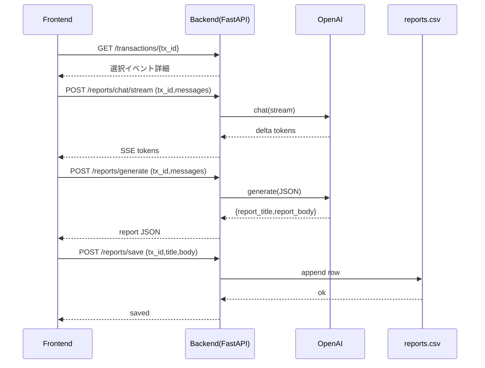

# イベント記録から日記/レポート作成（AIチャット＋CSV保存）実装計画

## 目的と前提

- **イベント=既存の `transactions`**（`frontend/app/page.tsx` のカレンダー/モーダルで「イベント」として扱われている）を起点にレポートを作成する。
- **「選択されたイベント」は URL クエリで渡す**：`/reports/create?tx_id=...`
- **AIチャットはストリーミング表示**（SSE想定）。
- OpenAI API 呼び出し・`data/reports.csv` への保存は **backend** で行う。

## 画面/導線（frontend）

- **カレンダー上部に「日記を作成」ボタン**を追加し、押下で「カレンダー表示のモーダル」を開く。
- モーダル内でイベント（FullCalendarイベント=tx）をクリックしたら `/reports/create?tx_id=...` に遷移。
- **イベント編集モーダル（`DayModal`）内に2つのボタン**を追加。
- **新規作成時**: 「追加し日記を作成」
    - 取引（イベント）を保存して `id` を取得 → `/reports/create?tx_id=<saved.id>` へ遷移。
- **イベント選択/編集中**: 「このイベントの日記を作成」
    - `form.id` を使って `/reports/create?tx_id=<form.id>` へ遷移。
- **新規ページ**: `frontend/app/reports/create/page.tsx` を新規実装（現状 `frontend/app/reports/create` は空）。
- ページで `tx_id` を読み取り、既存API `/transactions/{tx_id}` からイベント詳細を取得して「選択されたイベント」表示。
- AIチャットUI（送信→ストリーミング受信→表示）。
- 「レポート生成」→生成結果（タイトル/本文）を表示。
- 「保存」→backendへ保存依頼し、成功メッセージ。

## API/データ（backend）

- **CSV**: `backend/data/reports.csv` を新設し、`ensure_data_files()` で作成。
- 仕様カラム（固定）: `event_name,report_title,report_body,created_at,user_id`
- `event_name` は対象 transaction の `item` を使用（イベント名）。
- **認証**: レポート作成/保存は Cookie セッション（`/auth/me` と同様）でユーザー確定し、`user_id` をCSVに保存。
- **新ルータ**: `backend/app/routers/reports.py`
- `POST /reports/chat/stream`: チャット継続用（SSE）。入力は `tx_id` と `messages`（role/content）
- `POST /reports/generate`: チャット履歴＋イベント情報から `report_title`/`report_body` を生成（JSONで返却）
- `POST /reports/save`: `tx_id`＋生成済み `report_title`/`report_body` を受け取り、CSVへ追記して保存結果を返却
- **OpenAI**
- 環境変数: `OPENAI_API_KEY`
- 実装は `backend/app/services/reports.py` に集約（プロンプト、ストリーミング変換、JSON整形）。
- 依存追加: `openai`（または HTTP クライアント）を `backend/pyproject.toml` に追加。

## データフロー（概要）

## 主要な変更ファイル

- Backend
- [`backend/app/repositories/csv_store.py`](backend/app/repositories/csv_store.py): `reports.csv` の作成/読み書き追加
- [`backend/app/schemas/reports.py`](backend/app/schemas/reports.py): リクエスト/レスポンス型追加
- [`backend/app/services/reports.py`](backend/app/services/reports.py): OpenAI呼び出し＋整形
- [`backend/app/routers/reports.py`](backend/app/routers/reports.py): エンドポイント追加
- [`backend/app/main.py`](backend/app/main.py): `reports` ルータ登録
- [`backend/pyproject.toml`](backend/pyproject.toml): OpenAI/HTTPクライアント依存追加
- Frontend
- [`frontend/app/reports/create/page.tsx`](frontend/app/reports/create/page.tsx): 新規ページ（チャット＋生成＋保存UI）
- [`frontend/lib/api.ts`](frontend/lib/api.ts): `getTransaction`・`reportChatStream`・`generateReport`・`saveReport` を追加
- [`frontend/app/page.tsx`](frontend/app/page.tsx): 「日記を作成」導線（ボタン/モーダル）＋ DayModal からの遷移
- [`frontend/components/modals/DayModal.tsx`](frontend/components/modals/DayModal.tsx): 「このイベントの日記を作成」ボタンなど追加
- `frontend/components/modals/ReportSelectEventModal.tsx`（新規）: カレンダーモーダル
- （必要なら）`frontend/components/calendar/CalendarView.tsx`: 上部ボタン差し込み用Props追加